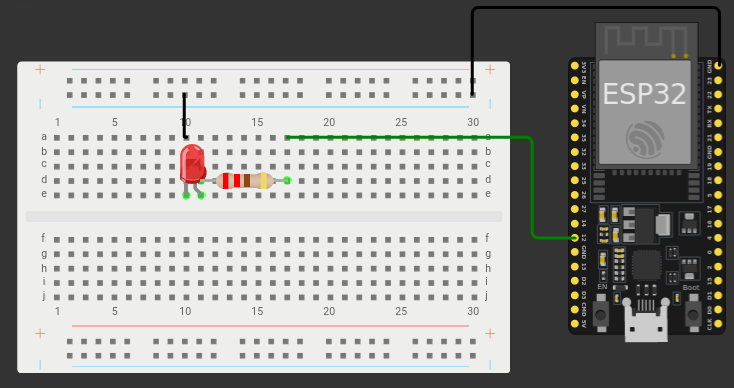

# Prática 1 - Ligando o LED interno do ESP22

> Programando com microcontrolador ESP 32

## 🛠️ Microcontrolador ESP 32

O ESP32 é um microcontrolador que inclui núcleos de CPU Xtensa, Wi-Fi, Bluetooth, muitos pinos GPIO, interfaces de comunicação como UART, SPI, I2C, ADC, DAC, memória flash e RAM, além de clocks e timers internos. Esses elementos permitem uma ampla variedade de aplicações em IoT e sistemas embarcados.

## 💻 Plataformas de Desenvolvimento com ESP32

Existem várias plataformas de desenvolvimento que podem ser usadas para programar o ESP32. Algumas das mais populares incluem:
1. **Arduino IDE**: Plataforma popular e amigável para programar o ESP32.
2. **PlatformIO**: Plataforma de desenvolvimento unificada para diversas IDEs.
3. **ESP-IDF**: Framework oficial da Espressif para desenvolvimento de firmware.
4. **MicroPython**: Implementação leve de Python 3 para prototipagem rápida.

Nesta prática foi ultilizado a plataforma **Arduino IDE**, com algumas libs para fazer a conexão com o **ESP32**.

## 📄 Datasheet do ESP 32

O [datasheet do ESP32](https://www.google.com/url?sa=t&source=web&rct=j&opi=89978449&url=https://www.espressif.com/sites/default/files/documentation/esp32_datasheet_en.pdf&ved=2ahUKEwjqyNbDvceFAxWxqpUCHWA-DnUQFnoECAYQAQ&usg=AOvVaw0aPqs26KTwgQAQ33yEvdPB) é um documento essencial para quem está trabalhando com esse microcontrolador, pois fornece informações detalhadas sobre suas características técnicas, pinagem, funções, interfaces, protocolos de comunicação e muito mais. Ele é utilizado como referência para o desenvolvimento de projetos e para entender melhor como utilizar todas as capacidades do ESP32 de forma eficiente. O datasheet é uma fonte confiável de informações técnicas precisas e é frequentemente consultado por engenheiros e desenvolvedores que estão criando dispositivos baseados no ESP32.

### 🔌 Pinout (GPIO)

Uma das principais caracteristicas em microcontroladores são suas interfaces de entrada e saida, o que chamamos de GPIO. Nesses elementos podemos definir valores logicos **HIGH (1)** ou **LOW (0)** para entradas e saidas e assim desenvolver diversos tipos de aplicações.

Ao acessar o **Datasheet do ESP32** podemos analisar o seu `pinout`:

<center>
    
</center>

Podemos ver que alguns pinos são destinados ao GPIO, e são nesses pinos que devemos ultilizar quando queremos usar elementos de **entrada** e **saida**.

## 🧪 Experimento 01 - Ligando o LED interno do ESP32

Entre esses pinos de GPIO, temos um em especifico **"o GPIO02"** que define um LED interno do ESP32. vamos fazer alguns testes com esse pino?

### 🧑‍💻 código em C

usamos o seguinte código para acender o LED interno do ESP32 que está localizado no GPIO02:

```C
const int led = 2;

void setup() {
  pinMode(led, OUTPUT);
}

void loop() {
  digitalWrite(led, HIGH);
  delay(100);
  digitalWrite(led, LOW);
  delay(100);
}
```
alguns aspectos e conceitos são interresantee neste simples código. são eles:

1. Ao analisar a primeira linha, podemos ver que o **GPIO02** é definido como **led = 2**, ou seja, se usarmos um **GPIOXX**, devemos usa-ló como **var = xx**;
2. Usamos a função **PinMode()** para definir se o GPIO é de entrada (INPUT) ou saida (OUTPUT);
3. Como o **LED** é definido como **OUTPUT**, devemos impor a ele ou uma saida alta (HIGH) ou uma saida baixa (LOW), e para fazermos isso usamos a função **digitalWrite(pino, <LOW/HIGH>)**.

## 🧪 Experimento 02 - Ligando um LED externo com o ESP32

Agora que já ligamos o LED interno do ESP32, vamos ligar um LED externo. para isso precisamos montar um pequeno e simples circuito.

### ⚡️ Montagem do circuito

<center>
    
</center>

perceba que precisamos colocar um resistor de **220 ohm** para limitar a correte no LED. Vemos que a perna "torta" do LED está relacionado ao positivo que ao sair do resistor vai diretamente para o pino 12 do ESP 32. o outro pino do led irá conectado com o **GND** do ESP 32.

### 🧑‍💻 código em C

O seguinte código foi usado para acender um LED externo:

```C
const int led = 12;

void setup() {
  pinMode(led, OUTPUT);
}

void loop() {
  digitalWrite(led, HIGH);
  delay(500);
  digitalWrite(led, LOW);
  delay(500);
}

```
Observe que o código é praticamente o mesmo que foi ultilizado para acender o LED interno do ESP 32, só que precisamos trocar para o **GPIO12** no caso **led = 12**.

[clique aqui](https://wokwi.com/projects/395356276825518081) para acessar a simulação dessa prática no **WORKIWI**.