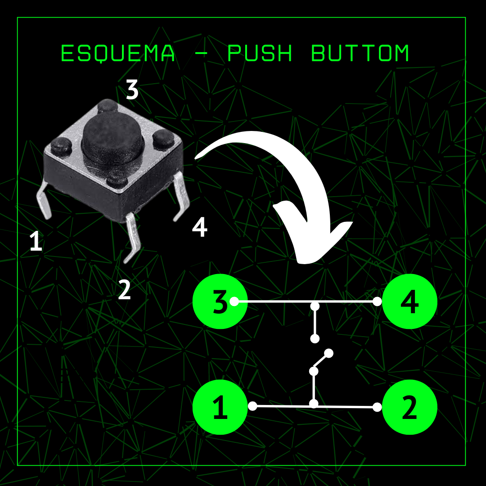
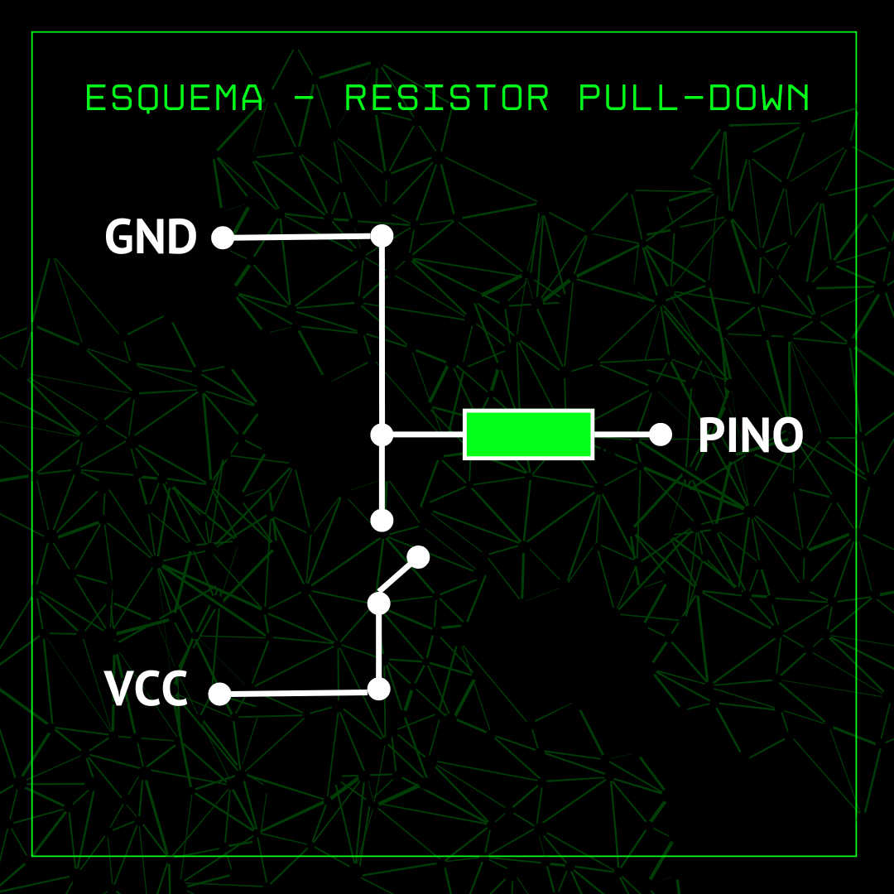
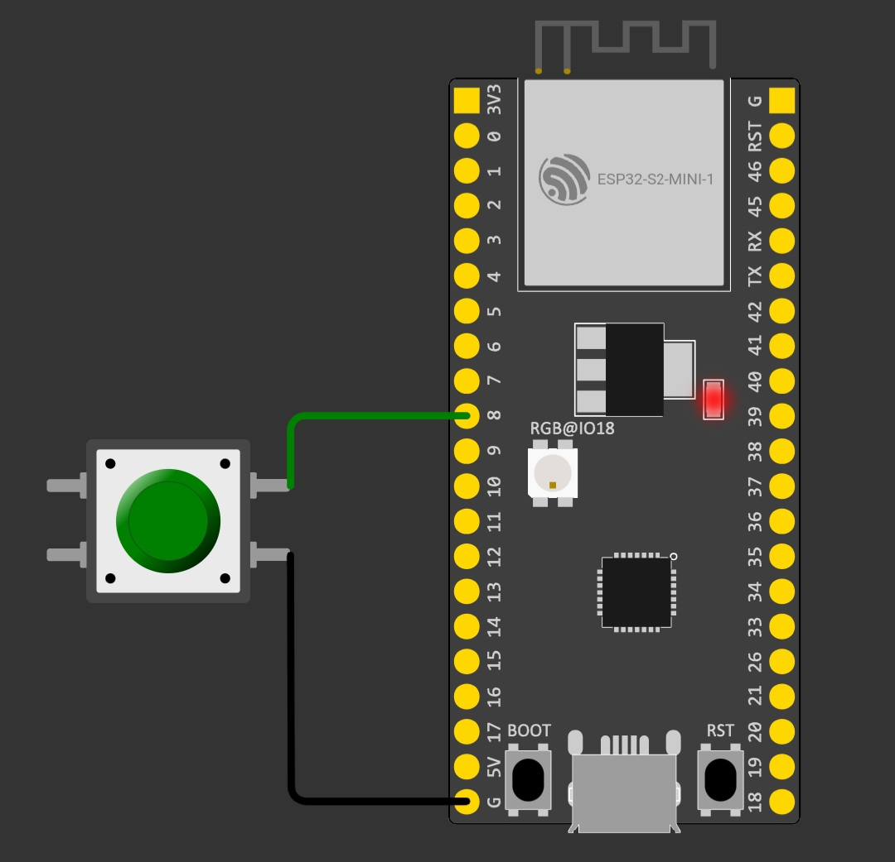
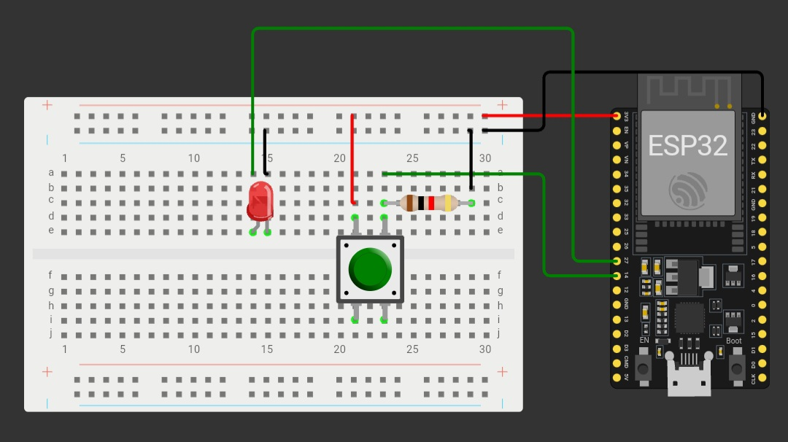

# Prática 3 - Ligando um LED com um botão

> Vamos usar um ESP para criar um circuito basico para acender um led usando o botão com duas configurações.

Antes de colocar a mão na massa, precisamos entender como o botão funciona:

## 🤔 Como Funciona o botão:

O botão é um componente de entrada (INPUT) fundamental em diversos sistemas, ele possui a simples mas porém importantissima função de habilitar ou não algo. Seu funcionamento é baseado na ligação ou na não ligação de um caminho para a passagem de corrente/tensão. vamos observar a imagem abaixo para compreender melhor:

<p align="center">
    
</p>

Geralmente usamos apenas um par de pinos, ou seja, ou usamos os pinos **1 e 3** ou **2 e 4**, sendo colocado em um uma **TENSÃO** e no outro um **GND**. Mas isso ainda não é o suficiente para podermos usa-ló, precisamos conhecer os modos de uso. Temos dois tipos de **Modo de uso** dos botões:

### 🔼 Modo usando resistor PULL-UP:

Quando queremos que uma determinada corrente/tensão seja interrompida quando precionamos o **push buttom** usamos um resistor PULL-UP:

<p align="center">
    
</p>

Nessa configuração, quando o botão não estiver precionado, a tensão **VCC** será repassado para o pino do microcontrolador. quando o botão for precionado o caminho entre o **GND** e o pino do microcontrolador será fechado e a tensão repassada para o pino será o **0V**.

🤔 mas porque usar esse resistor ai? tira isso que funciona! 

Então meu jovem... na prática até é possivel, mas não é recomendado pelos seguintes motivos:

1. **Proteção**: Sem um resistor de pull-up, a corrente que flui é determinada principalmente pela resistência interna do microcontrolador, que pode ser muito baixa e potencialmente danificar o pino de entrada.
2. **Redução do consumo de energia**: O resistor de pull-up mantém o pino de entrada em um estado logicamente alto quando o botão não está pressionado, o que pode ser importante para reduzir o consumo de energia em sistemas alimentados por bateria.
3. **Eliminação de flutuações de sinal**: O resistor de pull-up ajuda a evitar flutuações de sinal no pino de entrada que podem ocorrer quando o botão não está pressionado, garantindo uma leitura estável.

### 🔽 Modo usando resistor PULL-DOWN:

bastante similar com a configuração do resistor PULL-UP, temos o resistor PULL-DOWN dado por:

<p align="center">
    
</p>

Só que diferentemente do resistor PULL-UP, quando o botão não estiver precionado a tensão passada para o pino é **0V**. quando precionamos o **push button** a tensão repassada pada o pino do microcontrolador é igual a **VCC**.

## 🧪 Experimento 01 - Usando o botão como PULL-UP:

O Esp possui um resitor PULL-DOWN já imbutido, então para montarmos o circuito só precisamos apenas do botão, dos jumpers e do microcontrolador:

<p align="center">
    
</p>

### 🧑‍💻 código em C

para ativar o botão com o resistor pull-up, precisamos defini-ló no código:

```c
int botao = 8;
int dado;

void setup() {
  Serial.begin(115200);
  pinMode(botao, INPUT_PULLUP);
}

void loop() {
  dado = digitalRead(botao);

  if(dado){
    Serial.println(dado);
  }else{
    Serial.println(dado);
  }
  delay(100);
}
```

Definimos o botão como pull-up usando o **pinMode(pino, INPUT_PULLUP)**. Basicamente esse código irá imprimir no console serial 1 quando o botão não estiver precionado e 0 quando o botão for precionado.

## 🧪 Experimento 02 - Usando o botão como PULL-DOWN

Já para montarmos o circuito de um botão com o seu uso "padrão" (usando o resistor pull-down), precisamos usar de fato o resistor, como mostra o esquema abaixo:

<p align="center">
    
</p>

### 🧑‍💻 código em C

```C
int botao = 14;
int dado;
int led = 27;

void setup() {
  Serial.begin(115200);
  pinMode(botao, INPUT);
  pinMode(led, OUTPUT);
}

void loop() {
  dado = digitalRead(botao);

  if(dado){
    digitalWrite(led, HIGH);
  }else{
    digitalWrite(led, LOW);
  }
  Serial.println(dado);
  delay(100);
}
```

basicamente o led será acesso apenas quando o botão for precionado, que é verificado com o valor da flag **dado** que é o valor inteiro obtido pelo auxilio da função **digitalRead()**, que representa o estado do botão: 1 para precionado e 0 para não precionado.

## 🎛️ Simulação da prática

para acessar as simulações no **WORKIWI**:
- [PULL-UP](https://wokwi.com/projects/399254188490532865)
- [PULL-DOWN](https://wokwi.com/projects/395082653178675201)