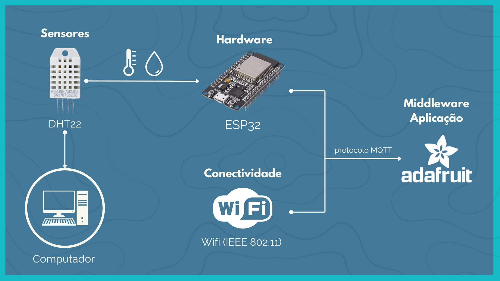
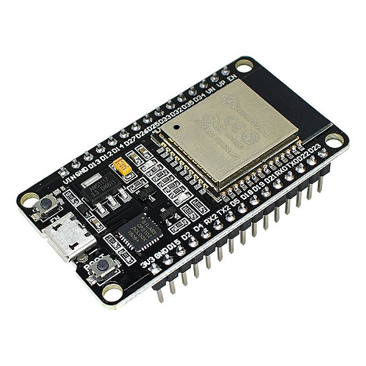
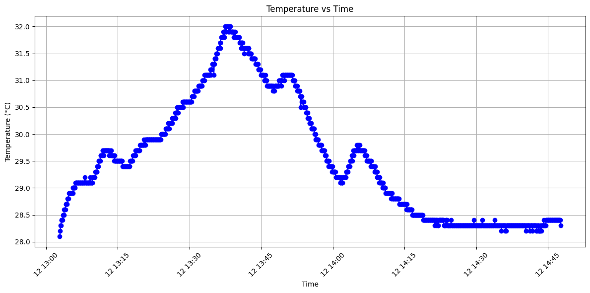
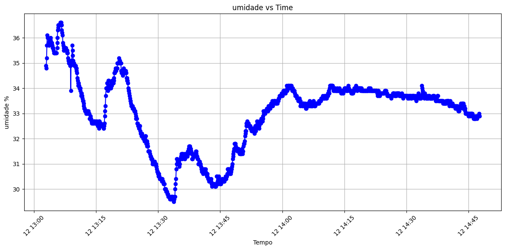

# Projeto 1 - Monitoramento Ambiental

> Projeto para monitoramento (temperatura e umidade) de um gabinete de computador. 

## 🧩 Contextualização do projeto

O objetivo do projeto desenvolvido na segunda unidade do curso visou aplicar na prática os conceitos vistos em aula e atender aos seguintes requisitos:

- 🚩 escolher um ambiente para monitorar a temperatura e umidade.
- 🚩 Obtenção de uma variável extra.
- 🚩 O dispositivo IoT deve possuir conectividade com a internet.
- 🚩 Os dados gerados devem ser enviados a uma aplicação.

A partir disso, desenvolvemos o dispositivo afim de atender todos os pontos listados anteriormente.

## 🔧 Arquitetura IoT

    

A arquitetura do projeto desenvolvido foi baseada na figura acima, que representa todas as camadas presentes no dispositivo IoT construído. A “coisa” que o dispositivo IoT monitora é o gabinete do computador, onde estão todas as peças internas. A coleta de dados é realizada pelo sensor de temperatura e umidade **DHT22**, processada pelo **ESP32**, e enviada via protocolo **MQTT** para a **plataforma Adafruit** para análise e visualização.

## 🔌 Dispositivos

Para a elaboração deste projeto, foi utilizado alguns dispositivos:

### 🔵 ESP32

    

O **ESP32** é um microcontrolador utilizado por sua flexibilidade e capacidade de integração com protocolos de comunicação como **Wi-Fi** e **Bluetooth**. Com dois microprocessadores Xtensa 32-bit LX6, frequência de clock até **240 MHz**, e **34 pinos GPIO** multifuncionais, o ESP32 é ideal para projetos IoT que requerem conectividade e processamento de dados.

### 🔵 Sensor DHT22

    

O **DHT22** é um sensor de **temperatura** e **umidade** que utiliza um termistor para medir a temperatura e um sensor capacitivo para medir a umidade relativa do ar. Ele emite um sinal digital pelo pino de dados, com uma faixa de medição de **-40 a 80°C** (precisão de ±0.5°C) e 0 a 100% RH (precisão de ±2-5% RH). No projeto, o DHT22 coleta dados do ambiente interno do gabinete do computador, visando identificar problemas de aquecimento ou umidade excessiva.

## 🛠️ Montagem do circuito

Utilizamos a ferramenta online [Workiwi](https://wokwi.com/) para auxiliar na montagem do nosso projeto. o circuito base pode ser visualizado na imagem abaixo:

    

## 💻 Plataformas e Aplicações

Utilizamos a plataforma **Adafruit.IO** para visualização e armazenamento dos dados coletados. Adafruit.IO suporta dispositivos IoT de diversos fabricantes e permite interação com dados em tempo real via protocolos **MQTT e HTTP**. A plataforma é intuitiva e facilita a criação de dashboards para monitoramento.

## 📊 Resultados e Dados

Após a implementação e testes, o dispositivo foi instalado no gabinete do computador e monitorado durante um período de duas horas. Durante o monitoramento, foram realizados testes de carga no computador, abrindo vários programas e abas do navegador para observar as variações de temperatura e umidade. podemos observar o gráfico da temperatura e da umidade abaixo:

    

    

